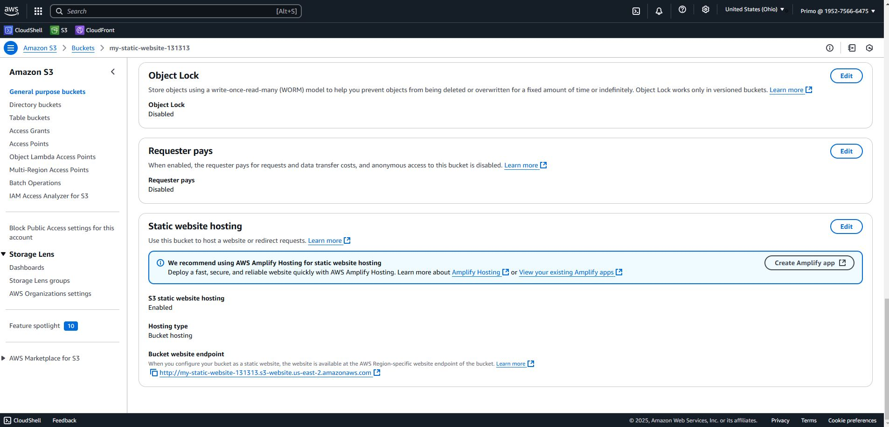
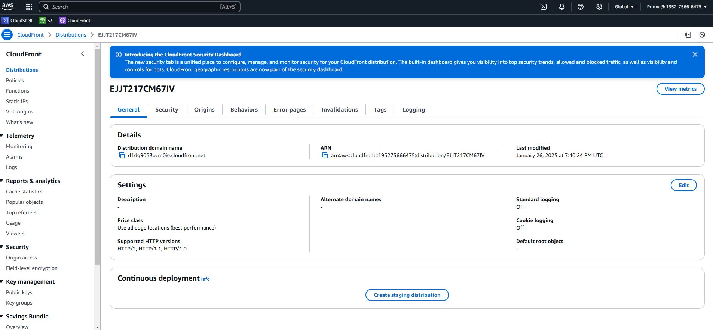
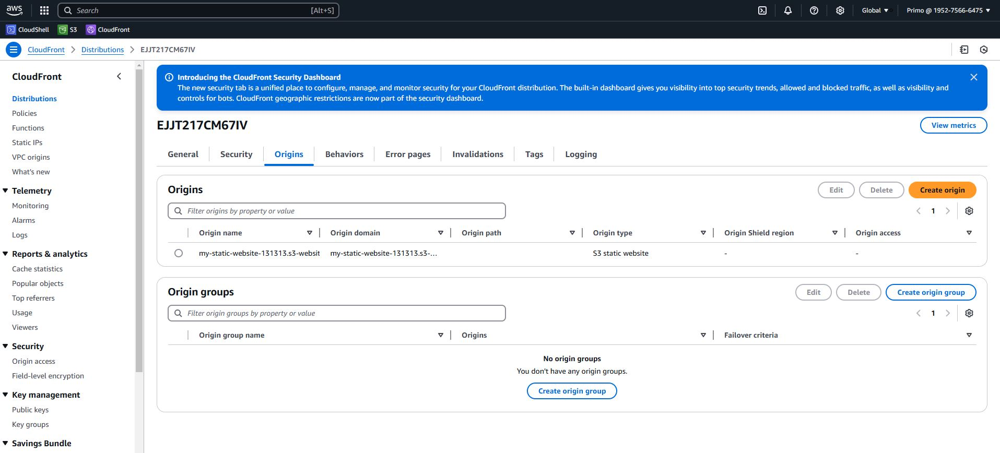
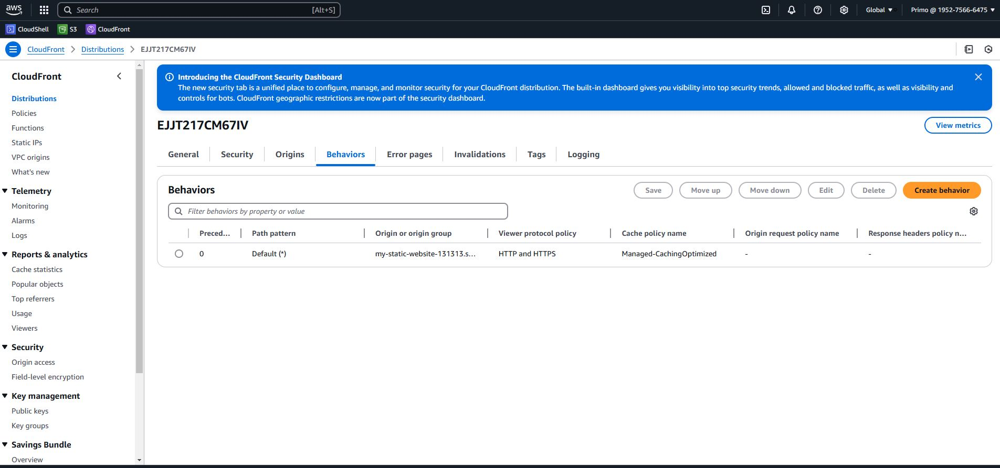
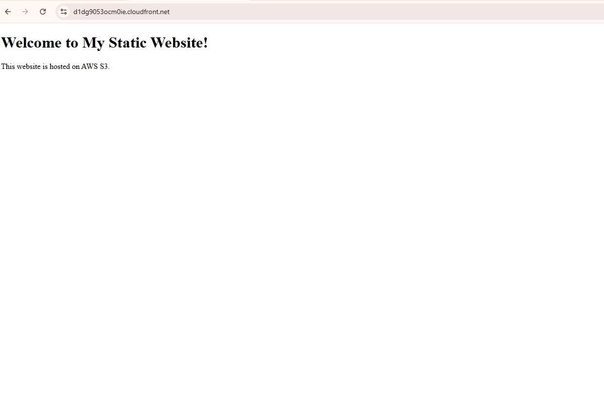

# S3 Static Website with CloudFront

## Overview
This project demonstrates how to host a static website on AWS S3 and distribute it globally using CloudFront.

## Features
- Static website hosting on S3.
- Global content delivery using CloudFront.
- Configured public access using bucket policies.

## Tools & Technologies
- **AWS S3**
- **AWS CloudFront**

## Steps to Recreate
1. Create an S3 bucket and enable static website hosting.
2. Upload `index.html` to the bucket.
3. Configure a CloudFront distribution to deliver the website globally.
4. Test the website using the CloudFront domain.

## Screenshots
### S3 Configuration

### CloudFront Configuration

### Live Website

## Live Website URL
- **CloudFront Domain Name:** [https://d1dg9053ocm0ie.cloudfront.net/]
